#  The Complete Power BI Reporting System Project.

## Overview:

This is one of my projects I did at Fullerton Health as a Data Analyst.

**Note: All data used in this project is not real. You can download the full Power BI report file (.pbix) here: [FHVI - Claim Report.pbix](https://drive.google.com/file/d/10bM1o_YF0BuL-8hVkMUOg5p64X19VnJw/view?usp=sharing)**

In this project, I built the system from scratch, including:

- Centralized data from multiple sources through ETL process.
- Designed OLAP data model for analysis.
- Created DAX measures for KPIs and business metrics.
- Designed Interactive Dashboard for management teams.
- Managed Power BI Service for report publishing and access control.

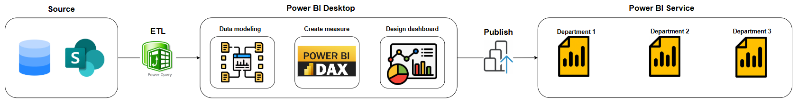

## Data source

- Company Databases
- Company Sharepoint

## Tech stack

- MariaDB
- Python
- Power BI

## Implementation process

### Centralized data from multiple sources through ETL process.

Imported data from 5 different sources — one from the company database and four Excel files stored on SharePoint.

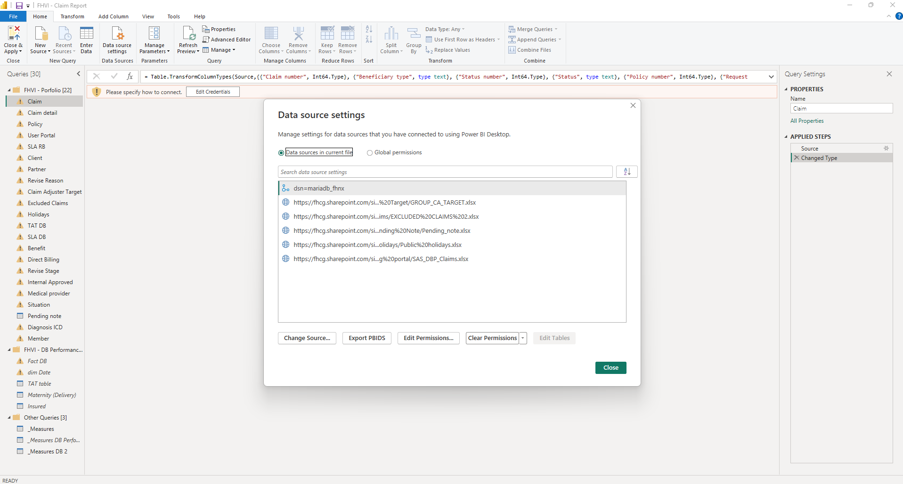

You can find all the SQL scripts used to extract data from the database in the folder here: [SQL_Scripts Folder](https://github.com/thanhluan13062000/DA_Project_Document/tree/main/FullertonHealth_Project/SQL_Scripts)

Below is one of the tables I imported into Power BI. Normally, I would perform several data transformation steps based on specific business requirements. However, in this project, the data provided was already clean and well-structured, so I only needed to promoted headers and changed column data types.

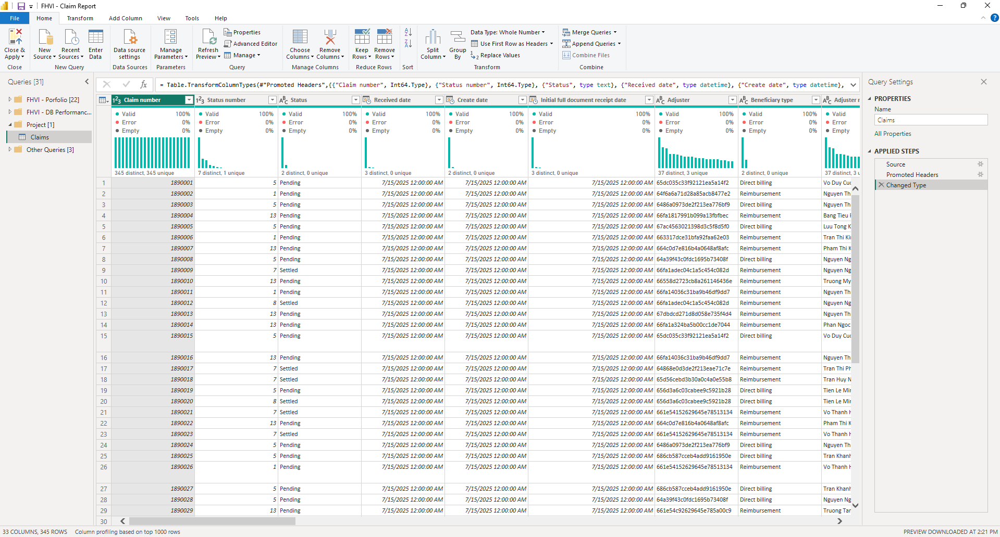

Load all tables to Power BI

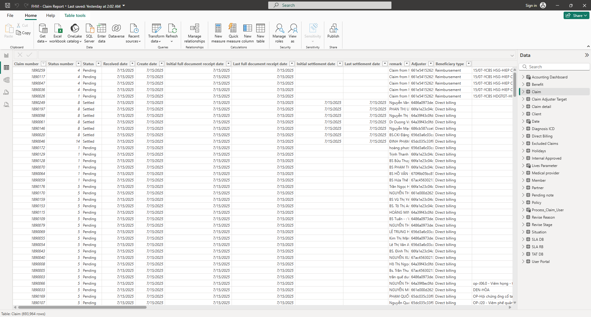

### Designed OLAP data model for analysis.

After the ETL process was completed and I had enough tables for data modeling.

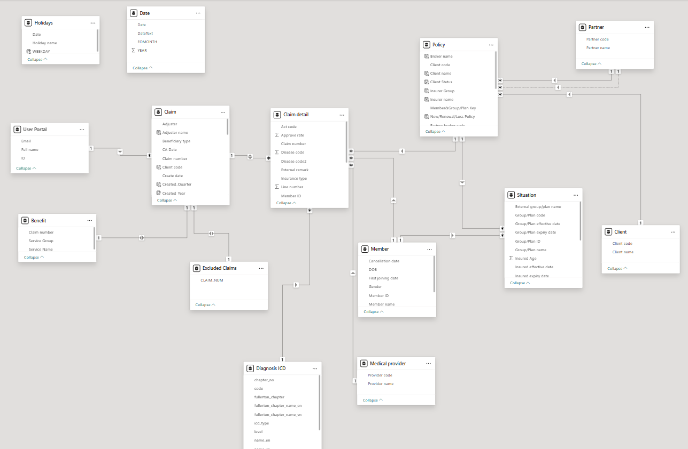

In this case, the data model includes two business processes:
The Claim process, and the Customer Enrollment and Group Change (CEGC) process.
The Claim process has two fact tables — Claim and Claim Detail — while the CEGC process has one fact table, Situation. All other tables are Dimension.
The Date table is created using DAX.

<pre>
Date = 
 ADDCOLUMNS(
    CALENDAR(
        DATE(2000,01,01),
        DATE(YEAR(TODAY()),MONTH(TODAY()),DAY(TODAY()))
    ),
    "DateText", FORMAT([Date], "dd/mm/yyyy"),
    "EOMONTH",
    SWITCH(
        TRUE(),
        EOMONTH([Date], 0) > TODAY(), TODAY(),
        EOMONTH([Date], 0)
    ),
    "YEAR",YEAR([Date])
 )

</pre>

### Created DAX measures for KPIs and business metrics.

1. Claim Processing Indicators.

- Total number of claims received, settled and pending.
- Turnaround time indicators for claims, including the number and percentage of claims processed on time.
- Classification of pending claims by time delay zone to identify and prioritize overdue cases for processing.

2. Claim Adjuster Productivity

- Measures the number of claims handled by each Claim Adjuster, along with the number and percentage of claims processed on time.

3. Customer Lives

- Tracks the total number of active customers (lives) covered under insurance policies over time, enables time-based analysis (month, quarter, or year) to monitor customer growth trends and retention performance

**Total number of claims**

<pre>
Claims_Count_Measure = 
  DISTINCTCOUNT('Claim detail'[Claim number])
</pre>

**Total claims settled and pending**

<pre>
Claims_Count_Filter = 
VAR Settled_Claims =
    CALCULATE(
        [Claims_Count_Measure],
        Claim[Status] = "Settled"
    )
VAR Pending_Claims =
    CALCULATE(
        [Claims_Count_Measure],
        ALLEXCEPT(Claim,Claim[Beneficiary type]),
        Claim[Status] = "Pending"
    )
VAR Selected_Status  =
    SELECTEDVALUE(Claim[Status])

RETURN
    SWITCH(
        TRUE(),
        Selected_Status  = "Settled",Settled_Claims,
        Selected_Status  = "Pending",Pending_Claims,
        [Claims_Count_Measure]
    )
</pre>

**Classification of pending claims by time delay zone to identify and prioritize overdue cases for processing**

<pre>
Pending_Red_Zone = 
    CALCULATE(
        SUMX('Pending note','Pending note'[Value]),
        'Pending note'[Status_Zone] = "1. Red_Zone"
    )
</pre>

<pre>
Pending_Amber_Zone = 
    CALCULATE(
        SUMX('Pending note','Pending note'[Value]),
        'Pending note'[Status_Zone] = "2. Amber_Zone"
    )
</pre>

<pre>
Pending_Yellow_Zone = 
    CALCULATE(
        SUMX('Pending note','Pending note'[Value]),
        'Pending note'[Status_Zone] = "3. Yellow_Zone"
    )
</pre>

<pre>
Pending_Green_Zone = 
    CALCULATE(
        SUMX('Pending note','Pending note'[Value]),
        'Pending note'[Status_Zone] = "4. Green_Zone"
    )
</pre>

<pre>
Pending_Pending_Doc = 
    CALCULATE(
        SUMX('Pending note','Pending note'[Value]),
        'Pending note'[Status_Zone] = "5. Pending_Doc"
    )
</pre>

**Measures the number of claims handled by each Claim Adjuster, along with the number and percentage of claims processed on time**

<pre>
Settled_Claims_For_KPI = 
    SWITCH(
        TRUE(),
        ISINSCOPE(Claim[Claim number]),AVERAGE(Claim[TAT_RB_&_DB]),
        ISINSCOPE('Claim Adjuster Target'[Adjuster]),[Claims_Count_Measure],
        [Claims_Count_Measure]
    )
</pre>

<pre>
% Settled_Claims_For_KPI = 
VAR TOTAL_CLAIMS =
    CALCULATE(
        [Claims_Count_Measure]
    )
VAR IN_TAT_CLAIMS =
    CALCULATE(
        [Claims_Count_Measure],
        Claim[In/Out_TAT] = "In TAT"
    )
RETURN
    SWITCH(
        TRUE(),
        ISINSCOPE(Claim[Claim number]),AVERAGE(Claim[TAT_RB_&_DB]),
        ISINSCOPE('Claim Adjuster Target'[Adjuster]),FORMAT(DIVIDE(IN_TAT_CLAIMS,TOTAL_CLAIMS),"00%"),
        [Claims_Count_Measure]
    )
</pre>

<pre>
KPI_for_Adjuster (set up color for conditional formating) = 
var _KPI =
    AVERAGE('Claim Adjuster Target'[Target])
var _SLA =
    AVERAGE(Claim[SLA Allowance])
var RESULT =
    SWITCH(
        TRUE(),
        ISINSCOPE(Claim[Claim number]),IF(CALCULATE(AVERAGE(Claim[TAT_RB_&_DB])) <= _SLA, "#00B050", "#F88379"),
        ISINSCOPE('Claim Adjuster Target'[Adjuster]),IF(CALCULATE([Claims_Count_Measure],Claim[Beneficiary type] = "Reimbursement") >= _KPI, "#00B050", "#F88379")
    )
return
SWITCH(
    TRUE(),
    OR(_KPI=0,CALCULATE([Claims_Count_Measure],Claim[Beneficiary type] = "Reimbursement")=0),BLANK(),
    RESULT
)
</pre>

**Tracks the total number of active customers (lives) covered under insurance policies over time**

<pre>
Member_Count_ = 
  VAR CutOffDate = SELECTEDVALUE('Date'[EOMONTH])
RETURN
  CALCULATE(
      COUNT(
          'Situation'[Member ID]
      ),
      'Situation'[Insured effective date] <= CutOffDate,
      'Situation'[Policy expiry date] >= CutOffDate,
      'Situation'[Policy effective date] <= CutOffDate,
      'Situation'[Insured expiry date] >= CutOffDate
  )
</pre>

**Note: These are not all the measures in this project — I’m only showing a few examples, because the model contains more than 50 measures. You can find all of them in the PBIX file linked at the top of this article**

### Designed Interactive Dashboard for management teams.

These are some dashboards I designed. Several of them feature interactive buttons to allow users to explore the data dynamically.

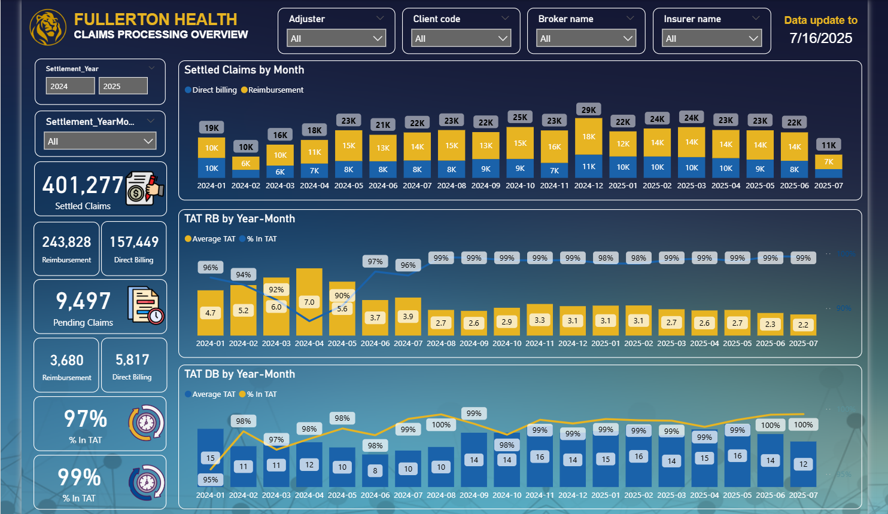
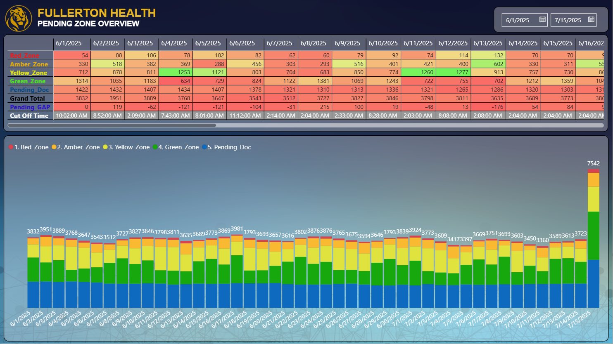
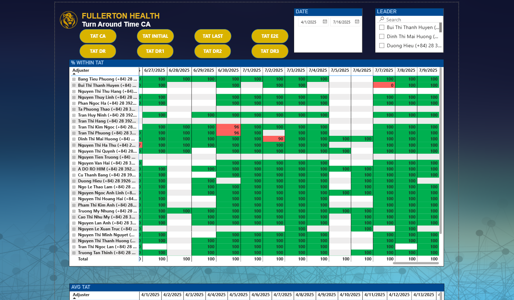
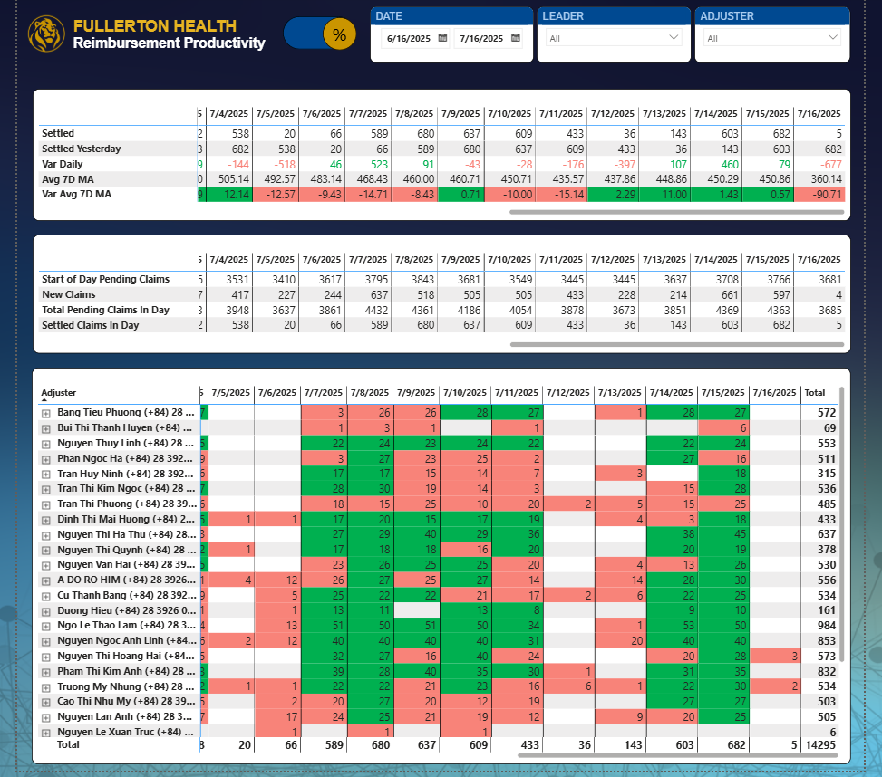
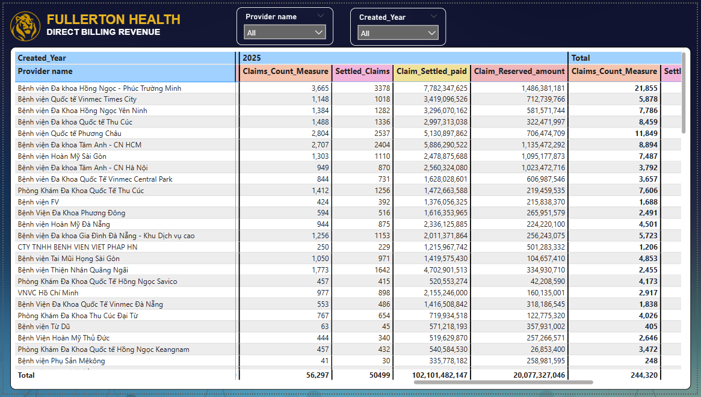
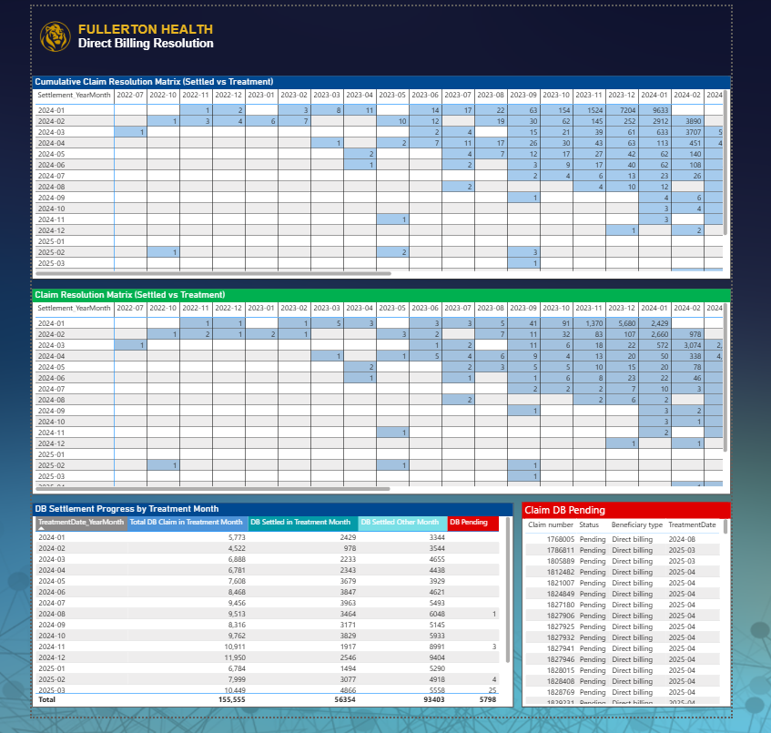
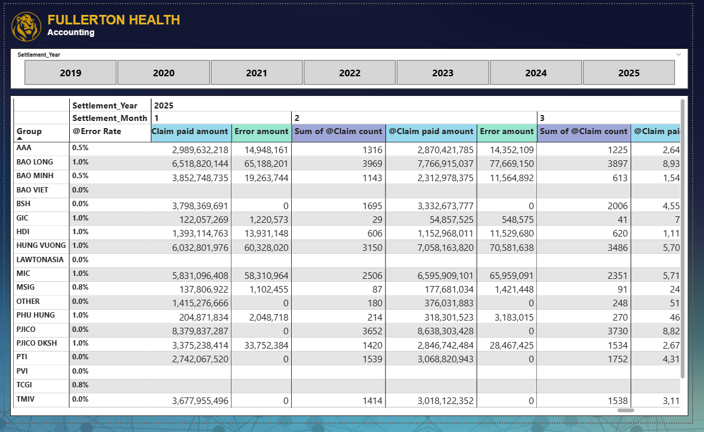
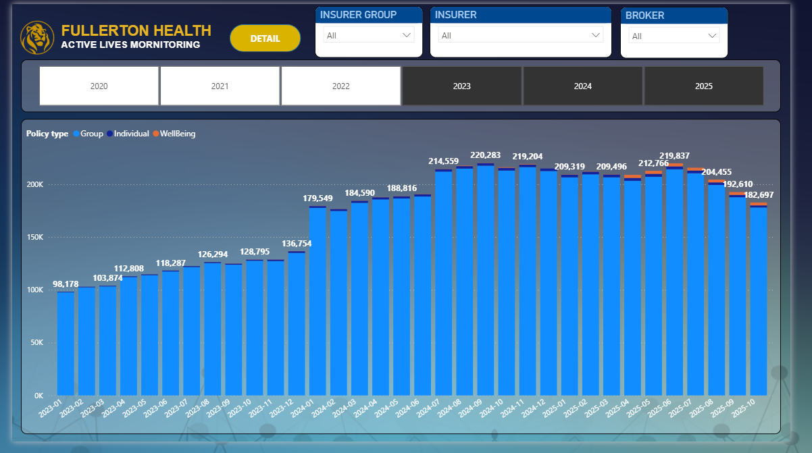

### Managed Power BI Service for report publishing and access control.

After completing the report, I published it on Power BI Service to share it with stakeholders and manage their access permissions.

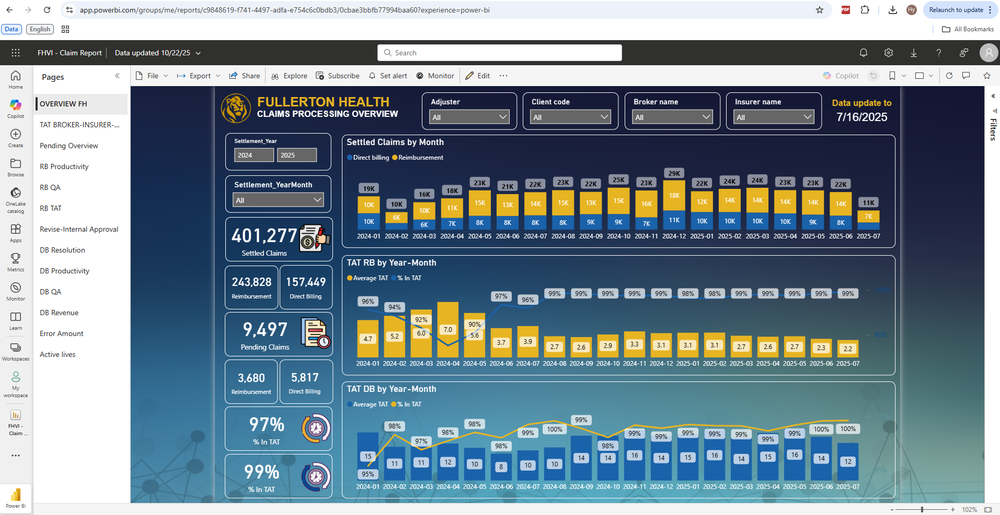

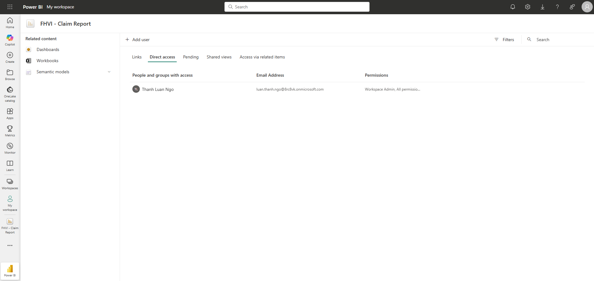

### Final Thoughts

Thanks for checking out my project!  
I had a lot of fun building this Power BI report and hope you’ll enjoy exploring it as much as I did creating it. 😄
