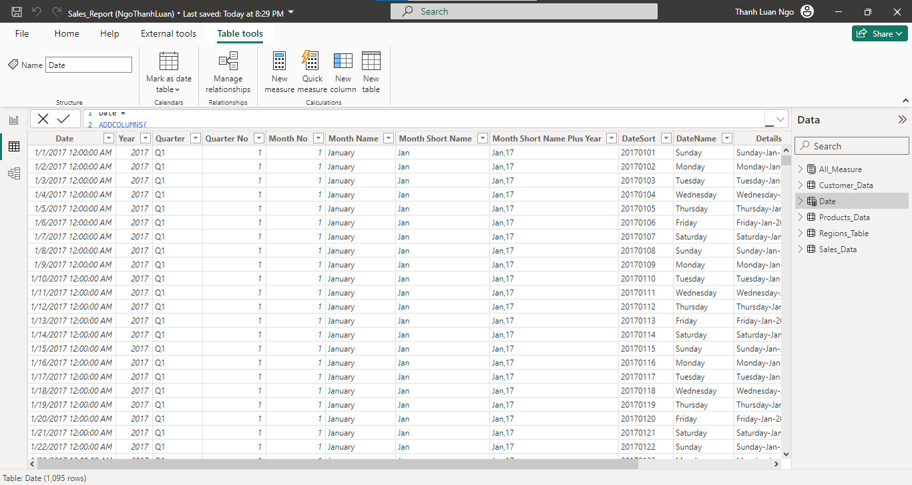
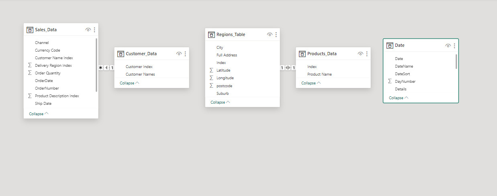
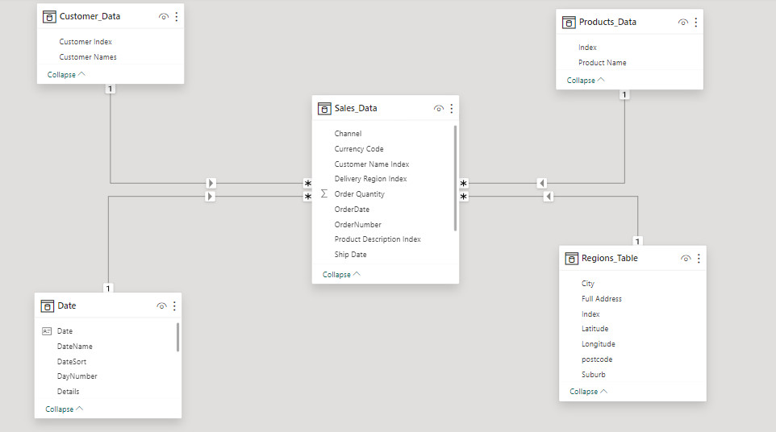
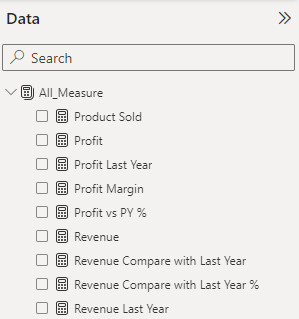
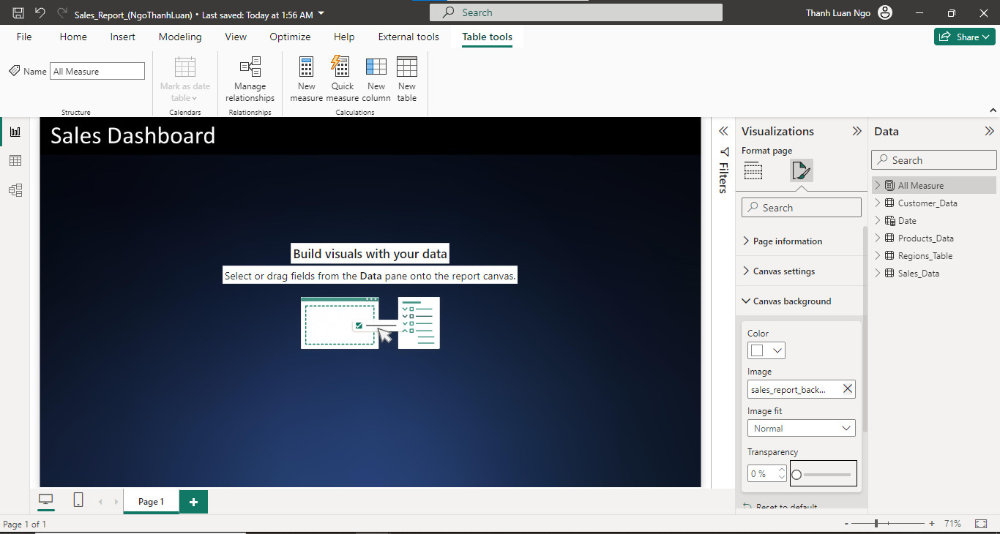
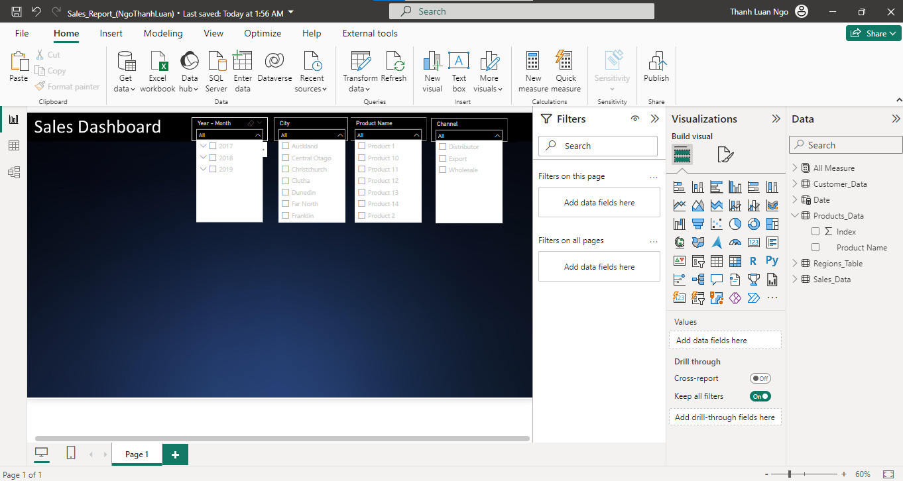
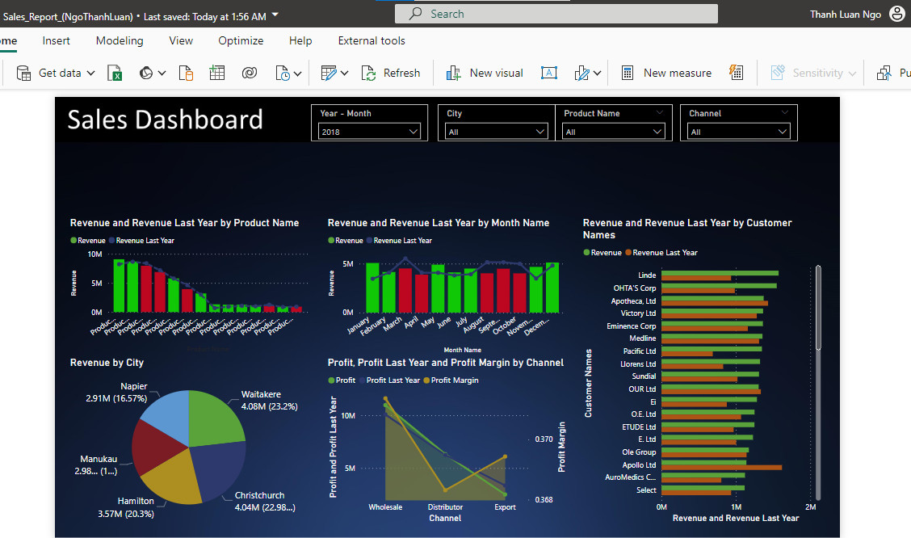
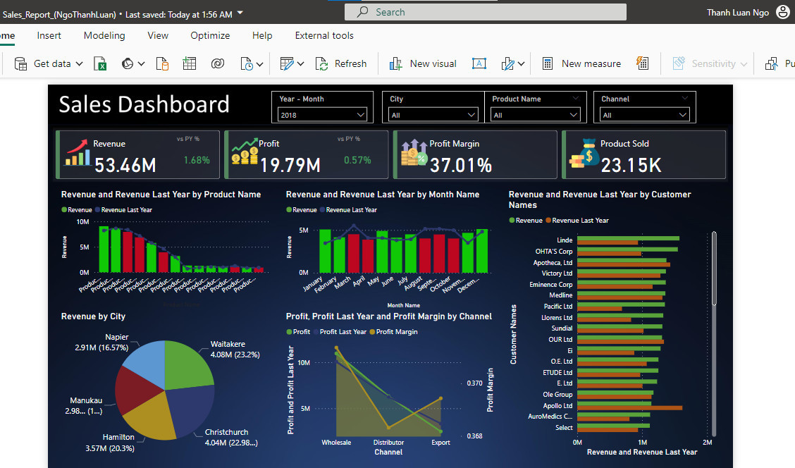
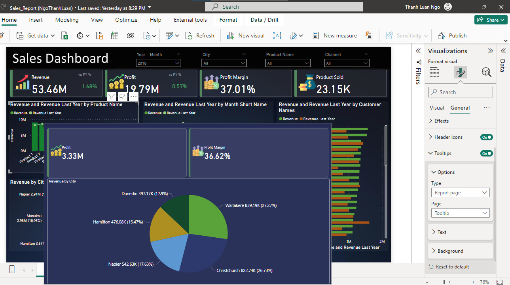

# Sales Report Project with Power BI
Why do we need to do this?
 Data is generated when a business starts its business process, synthesizing that data and creating reports showing the necessary indicators helps us clearly understand the operating status of the business.
 Indicators shown in this report include:
 •	Revenue
 <pre>o Total revenue
 o Revenue by year
 o Revenue by customer
 o Revenue by each region/city
 o Rate of increase/decrease in revenue compared to the previous year </pre>
 •	Profit
 <pre>o Total profit
 o Profit by year
 o Profit by business channel
 o Ratio of profit to revenue
 o Rate of profit increase/decrease compared to the previous year</pre>
 • Total goods sold
 
 From the information collected from the indicators in the report, I believe it can help us make decisions to optimize business operations.

## Data Sources
Sales Data: The primary dataset used for this report is the "Sales_Analysis_Report.xlsx" file, containing detailed information about each sale made by the company.
## Tools
- Power BI
## Implementation process
- Import data into power bi
<pre>
  - Download <b> Sales_Analysis_Report.xlsx </b> file
  - Import file into Power BI
</pre>
- Create date table with DAX language
<pre>
  Date = 
ADDCOLUMNS(
    CALENDARAUTO(),
    "Year",YEAR([Date]),
    "Quarter","Q"&FORMAT(CEILING(MONTH([Date])/3,1),"#"),
    "Quarter No",CEILING(MONTH([Date])/3,1),
    "Month No",MONTH([Date]),
    "Month Name", FORMAT([Date],"MMMM"),
    "Month Short Name", FORMAT([Date],"MMM"),
    "Month Short Name Plus Year", FORMAT([Date],"MMM,yy"),
    "DateSort",FORMAT([Date],"yyyyMMdd"),
    "DateName",FORMAT([Date],"dddd"),
    "Details",FORMAT([Date],"dddd-MMM-yyyy"),
    "DayNumber",DAY([Date]),
    "MonthSort",FORMAT([Date],"yyyyMM"
))
</pre>

 
- Modeling data
<pre>
  - Create relationships between tables
</pre>
<b>UNMODELED DATA</b>

 
<b>MODELED DATA</b>

- Create Measure
<pre>
  <b>Product Sold</b> = SUM(Sales_Data[Order Quantity])
  <b>Revenue</b> = SUMX(Sales_Data,Sales_Data[Order Quantity]*Sales_Data[Unit Selling Price])
  <b>Revenue Last Year</b> = CALCULATE([Revenue],SAMEPERIODLASTYEAR('Date'[Date]))
  <b>Revenue Compare with Last Year</b> = 
      VAR A = [Revenue] - [Revenue Last Year]
      VAR B = IF(ISBLANK([Revenue Last Year]),BLANK(),A)
      RETURN B
  <b>Revenue Compare with Last Year %</b> = DIVIDE([Revenue Compare with Last Year],[Revenue Last Year])
  <b>Profit</b> = SUMX(Sales_Data,[Revenue] - (Sales_Data[Unit Cost]*Sales_Data[Order Quantity]))
  <b>Profit Last Year</b> = CALCULATE([Profit],SAMEPERIODLASTYEAR('Date'[Date]))
  <b>Profit vs PY %</b> = DIVIDE([Profit] - [Profit Last Year],[Profit Last Year])
  <b>Profit Margin</b> = DIVIDE([Profit],[Revenue],0)
</pre>

- Create Report
  <pre>
    - Add background image
  </pre>
  
  <pre>
    -Create Slicer
  </pre>
    
  <pre>
    -Create Chart
  </pre>
  
  <pre>
    -Create Card
  </pre>
  
  <pre>
    -Create Tooltips
  </pre>
  

  Done ! The final report file name is " Sales_Report (NgoThanhLuan).pbix ", you can download it in [my repository](https://github.com/thanhluan13062000/DA_Project_Document.git)
. Many tks 😊😊😊 !

